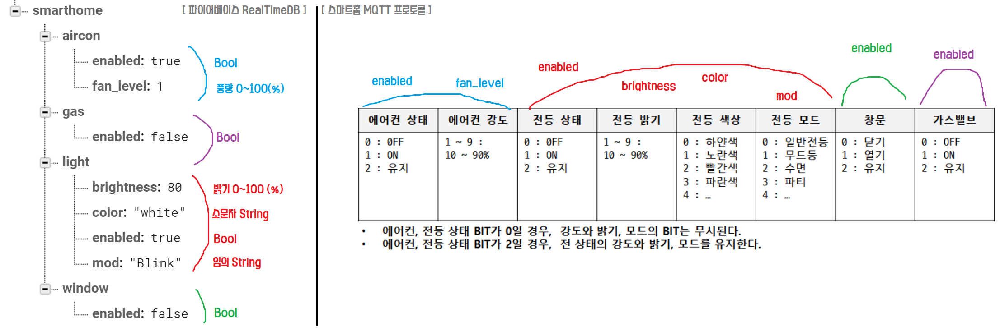

# Backend Server (처리서버)

본 문서에서는 백엔드 처리서버에 대해 다룹니다. (MQTT Broker 및 얼굴인식 부분은 본 문서에서 다루지 않습니다.)

<br>

## 📂 프로젝트 구조

```c#
📂Backend-Server
	┗ 📁firebase-python-sdk-key //파이어베이스 접속을 위한 KEY를 보관
		┗ 📃<firebase-sdk-key>.json
	┗ 📁module //각 모듈라이브러리를 저장
        ┗ 📁rabbitmq //MQTT를 사용하기위한 모듈
        ┗ 📁slack //slack을 사용하기위한 모듈
        ┗ 📁weather_api //날씨API를 사용하기위한 모듈
	┗ 📃programstart_manager.py //각 프로그램 총괄관리
	┗ 📃backend_process.py //MQTT 명령 처리 프로그램
	┗ 📃realtimedb_connect.py //파이어베이스 RealTimeDB를 접속관리하는 프로그램
	┗ 📃realtimedb.json //RealTimeDB에 현황을 파일로 실시간 업데이트
```

  <br>

## ✅ TODO

✅ 총괄 프로그램(programstart_manager)이 쓰레드가 아닌 프로세스를 실행하도록 변경

✅ 파이어스토어 스케쥴 확인 부분 추가

✅ 스마트홈 기기 제어 부분 추가

✅ 각 MQTT 함수는 독립적인 connection을 가집니다.

✅ MQTT 메시지 publish(전송)시 매 시점마다 채널을 열고/닫습니다.

✅ MQTT 메세지 consume(수신)시에 사용하는 채널을 분리합니다.

✅ 얼굴인식을 독립적인 프로세스로 진행함.

⬜ 각 기기(안드로이드,웹오에스)로 부터 받은 스케쥴값을 파이어베이스에 추가하는 기능 구현해야함.

⬜ 스케쥴 type이 once인 데이터는 실행후 삭제한다. (테스트 필요)

⬜ data.smarthome(clone)을 consume(수신)하여 작업 체크

  <br>

## 실행

```shell
sudo python3 programstart_manager.py
```

<br>


___


### programstart_manager

목적 : 백엔드 프로그램 총괄, 하위 프로그램 실행관리, 예외상황 발생처리, 서버 디바이스 모니터링 관리

Python3 로 작성되었으며, 의존 모듈은 아래와 같습니다.

```python
import os
import time
import multiprocessing as mp

from module.slack import slack
```


---


### realtimedb_connect

목적 : 실시간DB 접근/관리, 날씨API로부터 데이터 수신

Python3 로 작성되었으며, 의존 모듈은 아래와 같습니다.

```python
import time
import json

import firebase_admin
from firebase_admin import credentials
from firebase_admin import db

from module.weather_api import openweathermap_api
from module.slack import slack
```


---


### backend_process

목적 : MQTT 클라이언트(송신/수신), 파이어스토어 접근/관리, MQTT 및 파이어스토어 데이터 정제 및 처리

Python3 로 작성되었으며, 의존 모듈은 아래와 같습니다.

```python
import time
import threading
import json
import re
import os

import firebase_admin
from firebase_admin import credentials
from firebase_admin import firestore

from module.rabbitmq import rabbitmq_clinet
	┗ include pika
from module.slack import slack
   	┗ include requests
```


## 스마트홈 제어 (RealTime DB, MQTT 메세지)



